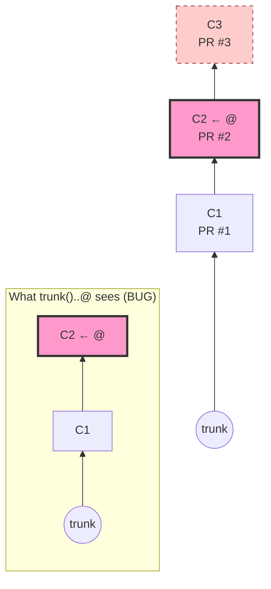
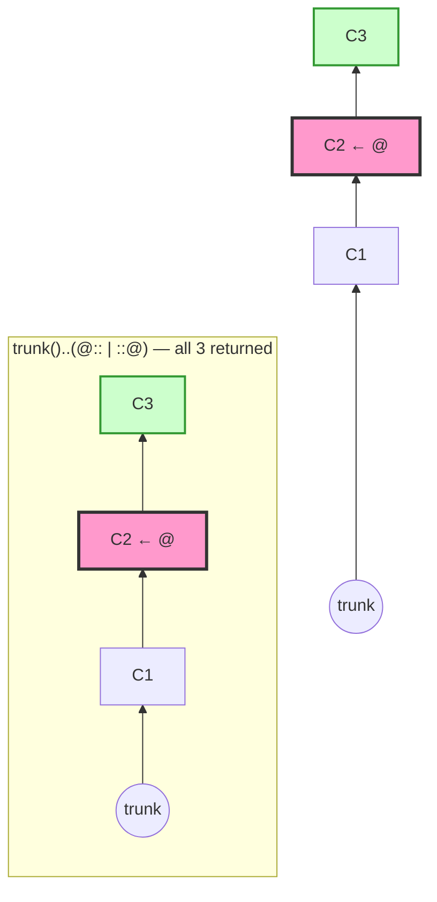
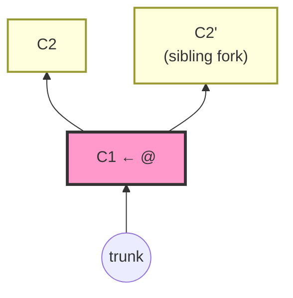
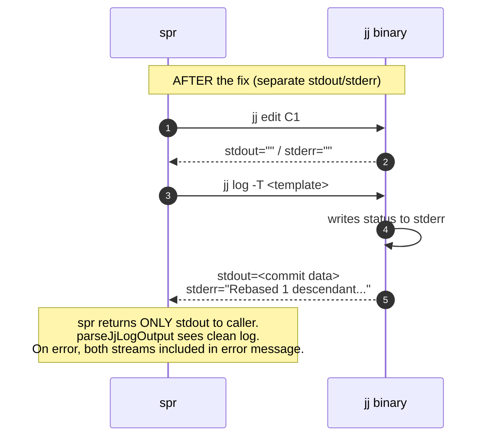

# `jj spr`: design notes

This document captures the design decisions made when bringing `spr` to
[Jujutsu](https://jj-vcs.github.io/jj/) colocated repositories. It's meant
for future contributors (and our future selves) trying to understand why
the jj-mode code looks the way it does.

The fork is in the `jj-compat` branch and aims to land upstream. All
changes are backward-compatible with git-only repos.

## Contents

1. [Guiding principle](#guiding-principle-lean-on-jj-dont-mimic-git)
2. [Auto-revset for stack discovery](#auto-revset-for-stack-discovery)
3. [Multi-head ambiguity](#multi-head-ambiguity)
4. [`spr edit` in jj mode](#spr-edit-in-jj-mode)
5. [`spr sync` in jj mode](#spr-sync-in-jj-mode)
6. [WIP truncation](#wip-truncation-kept)
7. [Conflicts: delegated to jj](#conflicts-delegated-to-jj)
8. [Cascade-orphan recovery](#cascade-orphan-recovery)
9. [VCS interface changes](#vcs-interface-changes)
10. [Bug fix: stdout/stderr separation](#bug-fix-stdoutstderr-separation)
11. [Testing strategy](#testing-strategy)
12. [Out of scope / deferred](#out-of-scope--deferred)
13. [Glossary](#glossary)

---

## Guiding principle: lean on jj, don't mimic git

The first version of jj support copied git's machinery: state files, op-id
snapshots, "rebase session" semantics. This caused real data-loss risks
because jj is fundamentally a different model from git:

| | Git | jj |
|---|---|---|
| Rebase model | **Blocking.** `git rebase -i` puts the repo in a state where most git commands refuse to run until the user resolves it. The repo enforces sequentiality. | **Non-blocking.** `jj edit` is instant. Descendants auto-rebase. Conflicts are first-class objects stored *in* commits — keep working, navigate, stack more edits, resolve later. The repo never gets "stuck." |
| Commit identity | Hash changes on every amend/rebase. | Stable change ID across rewrites; commit hash changes. |
| Push refusal | None — git pushes anything. | Refuses to push commits containing conflicts, empty commits, or commits without descriptions. |

Trying to enforce git's sequentiality through bookkeeping in jj mode is
futile (the user can sidestep it with raw `jj` commands) and dangerous
(the safety mechanism we built — `jj op restore` for abort — would nuke
unrelated user work). So the design pivoted to:

> **Use jj's native primitives. Where jj already does the right thing,
> spr does nothing. Where spr has to orchestrate, it does so by reading
> jj's stable concepts (change IDs, connected components, immutability)
> rather than imposing its own state.**

---

## Auto-revset for stack discovery

### The bug we fixed

The original jj implementation used `trunk()..@` to enumerate the stack.
When the user `jj edit`s a mid-stack commit (a common, expected jj
workflow), this revset returns only commits *up to* `@` — silently
dropping everything above. `spr update` from this state would close PRs
for the "missing" commits with *"commit has gone away"*. **Silent data
loss.**



The dashed C3 is what gets dropped — `spr update` then thinks PR #3's
commit is gone and closes the PR.

### The fix: connected-component revset

Use `trunk()..(@:: | ::@)` — the connected component containing `@`,
excluding trunk. Position-independent: the user can be anywhere in the
stack and spr returns the whole linear chain.



### Properties

- `@` anywhere in the stack → whole stack returned ✓
- `@` on a sibling stack → only that sibling returned ✓ (other stacks
  excluded because they're in different connected components)
- Empty stack (`@` on trunk with no commits above) → empty ✓
- WIP commits still flagged via subject prefix; truncation happens in
  the spr layer, same as git mode ✓
- Mid-stack insertion of a new (non-WIP, no commit-id trailer) commit →
  auto-handled by the existing trailer-add path; a new PR is created ✓

<details>
<summary><strong>Alternative considered: <code>spr-tip/&lt;branch&gt;</code> bookmark</strong></summary>

We briefly considered maintaining a `spr-tip/<branch>` bookmark as a
"return point" so the user could `jj new spr-tip/master` to get back to
the stack tip, and so spr could detect mid-stack `@` and offer to jump.

**Rejected** because:

1. Git spr has no equivalent concept. The stack is just `origin/master..HEAD`,
   regardless of where the user is looking.
2. The auto-revset solves the problem more cleanly: spr just doesn't care
   where `@` is.
3. The bookmark would need exclusion from the push glob, lifecycle
   management, multi-stack tiebreaker logic — solving a problem that
   evaporates once we drop `trunk()..@`.

</details>

<details>
<summary><strong>Alternative considered: 3-option prompt on mid-stack <code>@</code></strong></summary>

The original plan was a prompt when mid-stack `@` was detected:
**[J]ump to tip, [O]verride (push partial), [A]bort.**

Working through it:

- Auto-revset means mid-stack `@` isn't a problem anymore — no prompt
  needed for the common case.
- "Override" has no legitimate use case (`--count N` already exists for
  intentional partial pushes).

So the only remaining safety case is **multi-head ambiguity** (next
section), which is handled by refusing — not prompting.

</details>

---

## Multi-head ambiguity

If the user has multiple heads in their connected component (e.g. a fork
at C1 → C2 and C1 → C2'), spr can't decide which is "the stack tip."
spr's data model is a linear stack; non-linear stacks are unsupported.



`heads(trunk()..(@:: | ::@))` returns `{C2, C2'}` — two heads above trunk
in the connected component, so spr refuses with a clear message pointing
at the resolution (`jj rebase` to consolidate, or `jj edit` to pick a
side).

### Decision: refuse, don't prompt

The function `confirmIfIncompleteStack` (git's Y/N prompt) was renamed
to `checkStackUsable` and rewritten: print the error and return false.
**No "continue anyway"** — the failure mode (closing PRs for excluded
commits, or merging the wrong "top") has no safe override.

Previously called only by `update`, `merge`, and `status`. Extended to
also gate `amend` and `check` — both were silently affected by mid-stack
`@` before.

---

## `spr edit` in jj mode

### Side-by-side flow

```mermaid
sequenceDiagram
    autonumber
    participant user as User
    participant spr as spr
    participant git as git (rebase -i)
    participant jj as jj
    rect rgba(255,200,200,0.15)
    Note over user,git: git mode (blocking session)
    user->>spr: git spr edit
    spr->>user: numbered commit list
    user->>spr: pick N
    spr->>git: rebase -i with edit stop at N
    git-->>spr: paused at N
    spr-->>user: "make changes, then run --done"
    user->>user: edits files
    user->>spr: git spr edit --done
    spr->>git: add -u + commit --amend + rebase --continue
    git-->>spr: stack restored (or conflict)
    end
    rect rgba(200,255,200,0.15)
    Note over user,jj: jj mode (non-blocking)
    user->>spr: jj spr edit
    spr->>user: numbered commit list
    user->>spr: pick N
    spr->>jj: jj edit <change-id>
    jj-->>spr: @ on N (descendants auto-rebased)
    spr-->>user: "running jj edit X; jj undo to revert"
    user->>user: edits files (auto-snapshot)
    Note over user,jj: No --done / --abort needed.<br/>jj new <id> to navigate; jj undo to revert.
    end
```

### Decision: thin guidance + run `jj edit`

After the user picks a commit from the numbered list, `spr edit`:

1. Announces the action: *"Editing commit N (subject): running `jj edit <change-id>`"*
2. Runs `jj edit <change-id>` (via `JjOps.EditStart`)
3. Prints how to revert: *"To revert any changes: jj undo"*
4. Returns. `@` is now on the target commit. The user modifies files;
   jj auto-snapshots; descendants auto-rebase.

No state file. No op-id snapshot. No `--done` / `--abort` machinery at the
VCS level.

### `--done` and `--abort` are echo-only

These flags still exist on the CLI for compatibility. In jj mode they print:

```
jj does not track edit sessions. These flags are git-mode only.
To return after editing: jj new <change-id>
To revert changes:       jj undo
```

…and exit. The interface methods `EditFinish` / `EditAbort` are no-ops in
`JjOps`; the spr layer branches on `CommandName() == "jj spr"` and prints
the message instead of calling them.

<details>
<summary><strong>What we dropped (and why it was dangerous)</strong></summary>

The original jj support modeled `spr edit` as a session: a state file at
`.git/spr_edit_state` plus an `op_id` snapshot. The `--abort` path called
`jj op restore <opID>`.

This was the most dangerous bit: `jj op restore` doesn't undo *just* the
edit — it undoes **every operation since the snapshot**, including any
manual `jj new` / `jj commit` / `jj edit` the user did in between. A user
who started an edit, then did unrelated jj work, then ran `--abort` would
lose all of that intermediate work silently.

Replaced with `jj undo` as the user's tool, which they understand and
which only walks back one operation at a time.

</details>

---

## `spr sync` in jj mode

Git's `spr sync` runs `git cherry-pick ..<last-PR-commit-hash>` to pull
remote PR changes into the local branch. In jj mode this was literally
broken — the code called `gitcmd.Git("cherry-pick ...")` in a colocated
repo where jj manages the commit graph.

### Decision: run `jj git fetch`, exit

In jj's model, change IDs naturally align local and remote PR commits, so
the cherry-pick logic is unnecessary. The remaining useful action is to
fetch remote refs, which `jj git fetch` does. spr prints:

```
Running: jj git fetch
done. To also rebase onto the latest trunk, use `jj spr update`.
```

Rebase-onto-trunk is `spr update`'s job (it calls `FetchAndRebase` at the
start), not sync's. The hint pointing at `spr update` was added during
review to avoid confusing users about what sync does.

### Interface addition

Added `Fetch() error` to `VCSOperations`. Both `GitOps` and `JjOps`
implement it (`git fetch` / `jj git fetch`). It's symmetric so future
code can use it cleanly, even though only `SyncStack`'s jj branch uses
it today.

---

## WIP truncation: kept

Both git and jj modes use WIP markers (subject prefix `WIP`) as the
mechanism for "this commit and everything above are not ready to be
PR'd." spr's `UpdatePullRequests` and `syncCommitStackToGitHub` loops
break at the first WIP commit. We did NOT introduce a parallel
mechanism in jj mode — WIP markers are the universal opt-out.

---

## Conflicts: delegated to jj

We considered adding a `CheckStackHasConflicts()` to refuse pushing
conflicted commits. **Rejected** because `jj git push` already refuses
to push commits containing conflict markers, empty commits, or commits
without descriptions. spr would just be duplicating jj's safety.

The integration test
`TestJjIntegration_PushBranches_ConflictedCommit_Refused` pins this — if
jj ever loosens this default, we want to catch it.

---

## Cascade-orphan recovery

### The problem

When `spr merge` runs against a stack, GitHub's API is given exactly one
PR to squash-merge: the topmost mergeable PR (or the Nth, with
`--count`). Because each stacked PR's branch contains the cumulative
content of every PR beneath it, that single squash-merge absorbs the
*entire* unmerged sub-stack into one commit on trunk. spr then closes
every PR below the merged one with a "✓ Commit merged in #N" comment
(`spr/spr.go::MergePullRequests`). On GitHub these closed PRs have
`state: CLOSED` and `merged_at: null` — they're closed without a real
merge event. We call them **orphan PRs**.

In **git mode**, this is invisible: `spr update` runs `git fetch + git
rebase`, and git's default patch-id detection drops local commits whose
patches are already in trunk. The local stack self-heals.

In **jj mode**, plain `jj rebase` does not patch-id-drop absorbed
commits. Two failure modes appear:

1. **Empty stubs.** When the local commit's diff is *exactly* contained
   in the upstream squash, jj's 3-way rebase makes the local commit
   empty but keeps it. The stack accumulates `[EMPTY]` placeholders.

2. **Conflicts.** When the local commit's diff *overlaps* with the
   cumulative squash but is not bit-identical (because multiple PRs
   touched the same file in series, or the orphan commit was amended
   locally after the squash landed), jj's 3-way merge produces
   `[CONFLICT]` markers. Descendants inherit the conflict, so a single
   orphan can poison the entire stack. This is the form the polis
   stack hit.

`vcs/jj_cascade_integration_test.go::TestJjMode_CascadeOrphans`
characterizes both forms across 6 sub-tests.

### What spr does about it

Two changes layered on top of `jj rebase`:

- **`--skip-emptied`** (`vcs/jj_ops.go::FetchAndRebase`). Matches git
  rebase's patch-id self-healing for the clean case. Drops commits that
  end up empty after the rebase. Fixes the empty-stubs variant on its
  own.

- **Pre-rebase abandon of orphan local commits**
  (`spr/spr.go::identifyOrphanChangeIDs` →
  `vcs/jj_ops.go::AbandonChangeIDs`). On every `spr update`, spr
  queries GitHub for PRs in state `CLOSED` whose head ref matches the
  spr branch prefix (`github.GetClosedOrphanPRs`), maps them to local
  change IDs via the `commit-id:` trailer, and runs `jj abandon <id>`
  for each — *before* the rebase. This prevents both failure modes,
  because the orphan commits no longer exist in the local stack when
  rebase runs.

The two work together: `--skip-emptied` handles edge cases where the
GitHub query missed an orphan (network blip, branch prefix mismatch),
abandon handles the structural-overlap case where `--skip-emptied`
alone wouldn't be enough.

### Opt-out

Set `noPruneOrphans: true` in `.spr.yml` (or `~/.spr.yml`) to skip
orphan detection. Useful if you want to inspect closed-not-merged PRs
manually before their local copies vanish, or if you don't trust the
GitHub-side signal in your environment. With it on, `spr update`
behaves as before Phase 2c — `--skip-emptied` still handles the clean
cascade, but the drift / structural-overlap conflict cases will need
manual `jj abandon`.

### When you'd still need manual recovery

- **You merged from another machine and now run `spr update` here.**
  GitHub state is up to date, spr will detect the orphans, no manual
  steps needed.
- **You merged via the GitHub web UI bypassing spr.** Same — spr's
  detection is GitHub-side, not state-file-side, so any merge source
  is caught.
- **You edited an orphan commit before any `spr update`.** Detection
  is still automatic; the abandon runs before rebase regardless of
  whether the local commit drifted.
- **The orphan commit has descendants you don't want to lose.** jj's
  abandon preserves descendants' content (their patches are re-applied
  during auto-rebase). If you're worried, snapshot first with `jj op
  log` and `jj op restore` if anything goes wrong.

`handoffs/HANDOFF_SQUASH_CASCADE_ORPHANS.md` has the full incident
report from the polis stack that motivated this work.

---

## VCS interface changes

Minimal. Summary:

| Method | Change |
|---|---|
| `FetchAndRebase(cfg)` | No signature change |
| `Fetch()` | **New** — used by `spr sync` in jj mode |
| `GetLocalCommitStack(cfg, gitcmd)` | No signature change; jj impl revset changed |
| `AmendInto(commit)` | No signature change |
| `EditStart(commit)` | No signature change; jj semantics changed (runs `jj edit` directly, no session state) |
| `EditFinish()` / `EditAbort()` | No signature change; no-op in jj mode |
| `IsEditing()` | Always `false` in jj mode |
| `EditStatePath()` | Always `""` in jj mode |
| `CheckStackCompleteness()` | Repurposed (detects multi-head, not mid-stack `@`) |
| `PushBranches(cfg, commits, individually)` | No signature change; uses `cfg.User.BranchPrefix` |
| `PrepareForPush()` | No signature change; no-op in jj mode |
| `CommandName()` | No signature change |

The jj/git divergence for echo-only behaviors (sync, edit --done/--abort)
is done in the spr layer via `CommandName() == "jj spr"` checks rather
than by interface polymorphism. This is a pragmatic concession to
avoid rippling signature changes through `GitOps`, mocks, and tests for
~30 lines of logic that genuinely differ between modes.

---

## Bug fix: stdout/stderr separation

`vcs/jj_cmd.go` originally used `cmd.CombinedOutput()`, merging jj's
stderr (informational messages like *"Rebased 1 descendant commits onto
updated working copy"*) into the parsed output. After an operation that
triggered an auto-rebase, the next `jj log` call would have the rebase
message prepended to its actual log output — and parsers like
`parseJjLogOutput` would silently produce garbage commit hashes.

```mermaid
sequenceDiagram
    autonumber
    participant spr
    participant jj as jj binary
    Note over spr,jj: BEFORE the fix (CombinedOutput)
    spr->>jj: jj edit C1 (rewrites C1; auto-rebases C2)
    jj-->>spr: stdout="" + stderr=""
    spr->>jj: jj log -T <template>
    jj->>jj: writes status to stderr
    jj-->>spr: stdout+stderr merged:<br/>"Rebased 1 descendant...\n<commit-hash>..."
    Note over spr: parseJjLogOutput reads the rebase message<br/>as if it were the first commit hash<br/>→ garbage CommitHash<br/>→ later "jj bookmark set" sees garbage<br/>→ push fails with cryptic error
```



**Fix:** capture stdout and stderr separately. Return only stdout to
callers; include both in error messages. Caught by
`TestJjIntegration_PushBranches_ConflictedCommit_Refused` — exactly the
kind of regression that mock-based unit tests cannot catch.

---

## Testing strategy

Two suites:

| Suite | Build tag | Runner | What it covers |
|---|---|---|---|
| **Unit** | none (default) | `go test` | Happy + error paths of every interface method using `mockjj.Mock` (ordered command expectations). Fast, hermetic. |
| **Integration** | `//go:build integration` | `go test -tags=integration` | End-to-end against real `jj` binary in `t.TempDir()`-isolated colocated repos. Auto-revset against real revsets, op-log assertions, conflict refusal, multi-head detection. |

Integration tests fail if `jj` is missing UNLESS `SPR_SKIP_JJ_INTEGRATION=1`
is set. CI installs a pinned `JJ_VERSION` and runs both suites; coverage
is reported per-file with attribution showing which suite covers what.

The headline regression test is
`TestSprIntegration_StatusFromMidStack_ShowsFullStack` — it pins that the
original bug (closing PRs from a mid-stack `@`) stays fixed by running
spr against a real jj repo with `@` mid-stack and verifying the full
stack is returned.

### Fixture: `vcs/jjtest`

`jjtest.NewRepo(t)` creates a colocated git+jj repo in `t.TempDir()` with
a bare-repo `origin`. Helpers for building stack topologies:

- `AddCommit(t, subject, withTrailer)` — describe current `@` with new content, advance to fresh WC
- `InsertAbove(t, subject, withTrailer)` — `jj new` on top of `@` without modifying `@`
- `Edit(t, changeID)` — `jj edit <change-id>`
- `Fork(t, parent, subject)` — sibling fork (for multi-head scenarios)
- `At(t)` — current `@` change ID
- `SnapshotOpLog(t)` + `OpsSince(t, snap)` + `AssertOpsSince(t, snap, expected...)` — pin exactly which jj operations a code path produces

---

## Out of scope / deferred

These threads were left for later:

- **Multi-commit PRs.** Exists on a separate `claude/multi-commit-pr-support-*`
  branch; not yet merged into `jj-compat`. spr remains one-commit-per-PR
  in both modes.
- **jj version matrix in CI.** A single pinned `JJ_VERSION` for now;
  matrix when concrete drift appears or jj 1.0 lands.
- **GitHub-side PR verification.** Integration tests verify spr's
  *intent* via mockclient; not the GitHub-side outcome. Recorded
  fixtures or a live test repo would close this gap.
- **`RunMergeCheck` child-process pipeline.** Signal handling needs a
  controllable child process; defer.
- **`git/helpers.go` integration tests.** Git-mode helpers have low
  direct coverage; a `gittest` package mirroring `vcs/jjtest` would help
  but isn't urgent (git is the upstream, low churn).
- **`addReviewers` last ~9%.** Probably an error path; investigate next
  time it's touched.

---

## Glossary

- **Connected component**: in jj's revset language, the set of commits
  reachable from `@` either as ancestors or descendants. Written
  `@:: | ::@`. Excluding trunk gives the user's stack.
- **`trunk()`**: jj's name for the main branch tip on the remote.
  Default revset includes `master@origin` / `main@origin` and similar.
- **Change ID**: jj's stable identifier for a logical change, preserved
  across rewrites (unlike git's commit hash, which changes on amend).
  spr uses these for navigating in jj mode.
- **Commit-id trailer**: spr's own per-commit identifier (`commit-id:
  <8-hex>`) embedded in the commit description. Used to match local
  commits to GitHub PRs. Auto-added by `JjOps.GetLocalCommitStack` (jj
  mode) and `spr_reword_helper` (git mode).
- **WIP marker**: subject prefix `WIP` flags a commit as not ready for
  PR. spr's update/merge loops break at the first WIP commit.
- **Connected-component revset**: `trunk()..(@:: | ::@)` — the core of
  the auto-revset design. Returns the linear stack containing `@`,
  regardless of `@`'s position within it.
